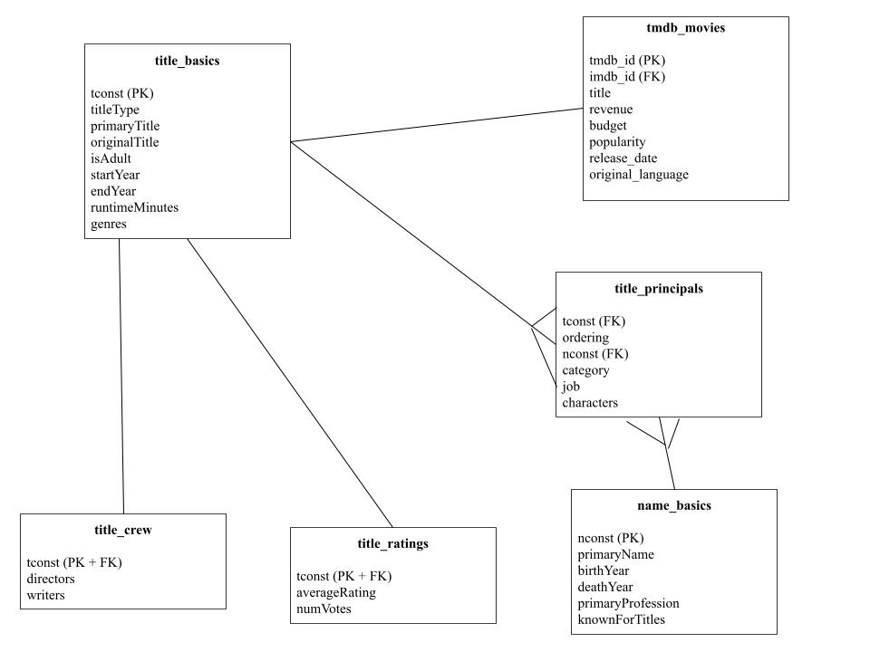

# DS 4320 Project 1: Predicting Box Office Revenue

This repository contains a fully constructed secondary dataset built using the relational model, combining IMDb metadata and TMDB financial data for 11,552 films. The dataset is used to train and evaluate regression models that identify which measurable film characteristics (production budget, genre, IMDb rating, runtime, release year, etc...) are the strongest predictors of worldwide box office revenue. The pipeline includes data acquisition, DuckDB-based relational storage, feature engineering, cross-validated model comparison, and publication-quality visualizations of results.

| Spec | Value |
|------|-------|
| Name | Tristen Davin |
| NetID | pnr3kr |
| DOI | [Link](https://doi.org/10.5281/zenodo.19356344) |
| Press Release | [New Data Analysis Reveals Which Movie Factors Are Most Strongly Linked to Box Office Success](press_release.md) |
| Data | [OneDrive Data Folder](https://myuva-my.sharepoint.com/:f:/g/personal/pnr3kr_virginia_edu/IgA_PYOb3HwCSpMPPwYHIHUQAUpFBBSGWIdr5p6QeB8HQS0?e=QVPMGc) |
| Pipeline | [pipeline.ipynb](pipeline.ipynb) |
| License | [MIT](LICENSE) |

---

## Problem Definition

### General and Specific Problem

- **Initial General Problem**
Predicting box office revenue is a persistent challenge in the film industry, as studios must make large financial commitments before knowing how a film will perform commercially.
- **Specific Problem**
Using IMDb metadata joined with TMDB financial data for 11,552 films, this project tries to build a regression model to predict box office revenue and determine which measurable film characteristics (production budget, genre, IMDb rating, runtime, release year, and language) are the strongest predictors.

### Rationale
 
The general problem was refined in three specific ways. First, the data source was narrowed to IMDb's official datasets joined with TMDB financial data, because IMDb provides the most complete publicly available film metadata while TMDB is a source that reveals box office revenue through a free API and together they allow the relational model to be built from scratch rather than relying on a pre-merged dataset. Second, the outcome variable was fixed to worldwide box office revenue specifically, because it is the most direct and consistently measured indicator of financial success across the dataset. Third, the analytical approach was specified as regression modeling because the goal is to produce a quantifiable answer for which features matter most, not just identify correlations. These choices together make the problem testable, reproducible, and directly answerable by the pipeline.
 
### Motivation
 
The film industry represents one of the highest-risk creative businesses, where studios regularly commit hundreds of millions of dollars to productions whose commercial outcome is uncertain until opening weekend. Despite this, investment decisions are often driven by intuition, precedent, or franchise familiarity rather than data. This project is motivated by the question of whether measurable film characteristics available before release such as budget, genre, and runtime can meaningfully predict box office revenue. If a regression model trained on historical IMDb and TMDB data can identify which features carry the most predictive weight, the findings could help producers, studios, and analysts make more data-informed decisions about which projects to greenlight and how to allocate resources.

### Press Release

[Budget Dominates the Box Office: New Data Analysis Reveals Which Movie Factors Are Most Strongly Linked to Box Office Success](press_release.md)
 
---
 
## Domain Exposition
 
### Terminology
 
| Term | Meaning | Why It Matters |
|------|---------|----------------|
| Box Office Revenue | The total amount of money a movie earns from ticket sales in theaters. | This is the main measure of financial success for a film. |
| IMDb Rating | A score given to movies by users on the IMDb platform based on audience reviews. | Ratings may influence audience interest and movie earnings. |
| Genre | The category or type of movie, such as action, comedy, or drama. | Different genres often perform differently at the box office. |
| Runtime | The total length of a movie measured in minutes. | Runtime may influence viewer engagement and theater scheduling. |
| Vote Count | The number of audience ratings submitted for a movie on IMDb. | Higher vote counts may reflect popularity or audience reach. |
| Release Year | The year a movie was released to the public. | Movie earnings can vary based on industry trends and market conditions at different times. |
 
### Domain Background
 
This project exists within the domain of the film industry and entertainment data analysis. The movie industry generates large amounts of data related to film production, audience reception, and financial performance. Factors such as genre, ratings, runtime, and release timing are studied to better understand what contributes to a movie’s success at the box office. By analyzing these variables, researchers and studios can gain insights into patterns that influence audience behavior and movie earnings. The IMDb dataset provides a large collection of movie information that can be used to explore how different film characteristics relate to financial success.

### [Background Reading](background/)
 
### Background Summary
 
| Title | Brief Description | Link |
|-------|-------------------|------|
| Study explores what really makes a movie successful | Discusses research on factors that contribute to a movie's success, including storytelling, audience appeal, and industry dynamics. | [background/01_phys_movie_success.pdf](background/01_phys_movie_success.pdf) |
| What does it take for a Film to be Considered a Success? | Examines what makes a film truly successful by analyzing critical reception, artistic merit, and box-office performance across some of the greatest movies ever made. | [background/02_why_people_watch_movies.pdf](background/02_why_people_watch_movies.pdf) |
| The 60 Movies That Have Made More Than $1 Billion at the Global Box Office | Provides a list and discussion of the highest-grossing films ever released. | [background/03_billion_dollar_films.pdf](background/03_billion_dollar_films.pdf) |
| 20 Most Profitable Movies of All Time Compared to Budget | Examines films that generated the largest profits relative to their budgets. | [background/04_yahoo_most_profitable_movies.pdf](background/04_yahoo_most_profitable_movies.pdf) |
| Here's the Top-Grossing Films for Each Year From 1977 to 2025 | Lists the highest-grossing movies for each year, showing how box office success changes over time. | [background/05_billboard_top_grossing_by_year.pdf](background/05_billboard_top_grossing_by_year.pdf) |
 
---

## Data Creation
 
### Provenance
 
The raw data for this project was obtained from two sources. The first source is IMDb's official dataset repository, located at datasets.imdbws.com, which provides several datasets free of charge for non-commercial use. The files were downloaded directly from the site as compressed TSV (Tab-Separated Values) files. The five files used are name.basics.tsv.gz, title.basics.tsv.gz, title.crew.tsv.gz, title.principals.tsv.gz, and title.ratings.tsv.gz, covering film metadata such as titles, genres, runtimes, ratings, and cast and crew information. Of the 12,376,284 titles in title_basics, records were filtered to only include titles where titleType is equal to 'movie', yielding 741,038 films. These were further restricted to films with a minimum of 5,000 IMDb user votes to ensure data quality, resulting in 18,681 movies. The second source is The Movie Database (TMDB) API, accessed at api.themoviedb.org. Since IMDb does not include box office revenue or budget figures, each of the 18,681 movies was queried against the TMDB API using its IMDb ID to retrieve budget, revenue, and additional metadata. After filtering out records where revenue was zero or missing, the final dataset contains 11,552 movies with revenue data.
 
### Code
 
| File | Description | Link |
|------|-------------|------|
| pipeline.ipynb | Full data creation, loading, modeling, and visualization pipeline. | [pipeline.ipynb](pipeline.ipynb) |
 
### Bias Identification
 
Several sources of bias may have been introduced during the data collection process. First, IMDb data is subject to selection bias, as not all films ever produced are equally represented: older films, foreign language films, and low-budget independent productions are likely underrepresented compared to mainstream Hollywood releases. Second, the ratings in title.ratings.tsv.gz reflect self-selection bias, since only IMDb users who choose to leave a rating are counted, meaning rating scores may not represent the general population's opinion of a film. IMDb's user base also skews toward certain demographics, which may introduce further bias. Third, applying a minimum threshold of 5,000 user votes introduces deliberate selection bias toward well-known, widely seen films, meaning smaller and independent productions are systematically excluded. This reduced the dataset from 741,038 movies to 18,681, and after filtering for TMDB revenue data, to 11,552. Fourth, the TMDB API introduces coverage bias, as revenue and budget figures are more consistently available for major studio releases than for smaller or international films. Finally, survivorship bias exists across all files, as films that received little attention or were never widely released may have incomplete or missing records.
 
### Bias Mitigation
 
Several strategies can be applied to handle, quantify, and account for the biases identified in the data collection process. To address selection bias, the dataset is filtered to only include records where titleType equals 'movie', focusing the analysis on a well-represented and consistently structured subset. The 5,000 vote threshold, while introducing its own selection bias toward popular films, simultaneously mitigates self-selection bias in ratings by ensuring that average scores are based on a statistically meaningful number of submissions. This tradeoff is documented and the reduction from 741,038 to 18,681 movies is reported transparently. The demographic bias of IMDb's user base cannot be fully eliminated, but conclusions about audience reception will be framed as reflecting IMDb users specifically rather than general audiences. TMDB coverage bias is mitigated by filtering out all records with zero revenue values, reducing the dataset further to 11,552 movies, and the proportion of records dropped at each filtering stage is reported so the impact on the final dataset is transparent.
 
### Rationale for Critical Decisions
 
Several critical judgment calls were made throughout this project that required deliberate reasoning to handle uncertainty. The first major decision was to focus exclusively on movies rather than all title types available in the IMDb dataset, such as TV series or short films. This choice was made because movies represent the most complete and consistently structured records in the dataset and are most directly tied to box office earnings, which is the primary interest. Mixing title types would introduce significant inconsistencies in runtime, release structure, and revenue measurement.

The second key decision was to apply a minimum threshold of 5,000 IMDb user votes before querying the TMDB API. Movies with very few votes are unlikely to have revenue data in TMDB, making API calls for them wasteful and getting data for all 741,038 movies in the dataset would have taken over ten hours, making the project computationally impractical. The threshold reduced the dataset from 741,038 movies to 11,552 while retaining the most well-known and commercially relevant films. The chosen value is clearly documented and its effect on sample size is reported.

The third key decision was to supplement the IMDb dataset with revenue data from the TMDB API rather than using a pre-built Kaggle dataset. This choice was made to ensure the data pipeline follows the relational model, with records joined programmatically on shared identifiers rather than relying on a third party's merged file. This introduces some uncertainty around TMDB coverage, which is reduced by filtering out records with zero revenue values. The final dataset of 11,552 movies with complete revenue, rating, genre, runtime, and cast information provides a solid foundation for analyzing the characteristics associated with box office success.
 
---
 
## Metadata
 
### Schema
 

 
### Data Tables
 
| Table | Description | Link |
|-------|-------------|------|
| final_movies | Core movie information including title, genre, release year, and runtime | [final_movies.csv](https://myuva-my.sharepoint.com/:x:/g/personal/pnr3kr_virginia_edu/IQBoxter-ISqS6lD_vmillBfAcsa-qybHLbC_GrVM8OIyz0?e=PYchL2) |
| final_ratings | IMDb user ratings and vote counts for each movie | [final_ratings.csv](https://myuva-my.sharepoint.com/:x:/g/personal/pnr3kr_virginia_edu/IQC3FgIY3ffaRI_hfkcVNIRnAfZ3BvziGbkcScJUAWuxe20?e=d6vpuP) |
| final_crew | Directors and writers for each movie | [final_crew.csv](https://myuva-my.sharepoint.com/:x:/g/personal/pnr3kr_virginia_edu/IQA46ImEUqzkRaiPu5AR6lJwAQxw8tAyxGqx9VSoWywboAA?e=3HjSta) |
| final_principals | Principal cast and crew members for each movie | [final_principals.csv](https://myuva-my.sharepoint.com/:x:/g/personal/pnr3kr_virginia_edu/IQD6zGMTwHx3QowYGFEqmuwHAVqwst1yM4w99pvN5xSV6NY?e=gziJre) |
| final_names | People in the industry including names, birth years, and professions | [final_names.csv](https://myuva-my.sharepoint.com/:x:/g/personal/pnr3kr_virginia_edu/IQCYeOfknISVR4YlCRd8G1NXAT3LyOXBwKNUdmGOOOOSIgs?e=PihjtF) |
| tmdb_movies | Box office revenue, budget, popularity, and release data from TMDB | [tmdb_movies.csv](https://myuva-my.sharepoint.com/:x:/g/personal/pnr3kr_virginia_edu/IQDzoe6jWbjYTL87l5eBolFoAeU8aWK2fmAlNM4Nhi894RY?e=ezy2Cr) |
 
### Data Dictionary
 
| Table | Feature | Data Type | Description | Example |
|-------|---------|-----------|-------------|---------|
| title_basics | tconst | string | Unique IMDb identifier for each title | tt0111161 |
| title_basics | titleType | string | Type of title | movie |
| title_basics | primaryTitle | string | Most commonly used title | The Shawshank Redemption |
| title_basics | originalTitle | string | Original language title | The Shawshank Redemption |
| title_basics | isAdult | boolean | Whether the title is adult content | 0 |
| title_basics | startYear | integer | Release year of the movie | 1994 |
| title_basics | endYear | integer | End year (null for movies) | \N |
| title_basics | runtimeMinutes | integer | Runtime in minutes | 142 |
| title_basics | genres | string | Comma separated list of genres | Drama,Crime |
| title_ratings | tconst | string | Unique IMDb identifier (FK) | tt0111161 |
| title_ratings | averageRating | float | Weighted average of user ratings (1-10) | 9.3 |
| title_ratings | numVotes | integer | Number of user votes | 2700000 |
| title_crew | tconst | string | Unique IMDb identifier (FK) | tt0111161 |
| title_crew | directors | string | IMDb nconst ID(s) of director(s) | nm0001104 |
| title_crew | writers | string | IMDb nconst ID(s) of writer(s) | nm0001104 |
| title_principals | tconst | string | Unique IMDb identifier (FK) | tt0111161 |
| title_principals | ordering | integer | Ranking of cast/crew member within title | 1 |
| title_principals | nconst | string | Unique IMDb identifier for person (FK) | nm0000209 |
| title_principals | category | string | Role category of the person | actor |
| title_principals | job | string | Specific job title if applicable | \N |
| title_principals | characters | string | Character name(s) played | ["Andy Dufresne"] |
| name_basics | nconst | string | Unique IMDb identifier for each person | nm0000209 |
| name_basics | primaryName | string | Most commonly credited name | Morgan Freeman |
| name_basics | birthYear | integer | Year of birth | 1937 |
| name_basics | deathYear | integer | Year of death if applicable | \N |
| name_basics | primaryProfession | string | Top three professions | actor,producer,director |
| name_basics | knownForTitles | string | IMDb tconst IDs of notable titles | tt0111161,tt0317248 |
| tmdb_movies | tmdb_id | integer | Unique TMDB identifier | 278 |
| tmdb_movies | imdb_id | string | IMDb tconst identifier (FK) | tt0111161 |
| tmdb_movies | title | string | Movie title as listed on TMDB | The Shawshank Redemption |
| tmdb_movies | revenue | integer | Worldwide box office revenue in USD | 16000000 |
| tmdb_movies | budget | integer | Production budget in USD | 25000000 |
| tmdb_movies | popularity | float | TMDB internal popularity score | 98.7 |
| tmdb_movies | release_date | string | Release date in YYYY-MM-DD format | 1994-09-23 |
| tmdb_movies | original_language | string | Two letter language code | en |
 
### Uncertainty Quantification
 
| Table | Feature | Min | Max | Mean | Std Dev | Missing | Uncertainty Source |
|-------|---------|-----|-----|------|---------|---------|-------------------|
| final_ratings | averageRating | 1.3 | 9.3 | 6.51 | 0.99 | 0 | Self-selection bias; CV = 15.2%, indicating moderate rating spread across films |
| final_ratings | numVotes | 5,006 | 3,169,184 | 90,657.65 | 183,550.86 | 0 | Std dev is 2.0x the mean, indicating heavy right skew toward blockbusters |
| final_movies | startYear | 1915 | 2026 | 2002.78 | 17.65 | 0 | Older films underrepresented; 95% of films fall between 1968–2026 (mean ± 2σ) |
| final_movies | runtimeMinutes | 43 | 566 | 109.62 | 22.0 | 0 | CV = 20.1%; outliers may reflect director's cuts or alternate versions |
| tmdb_movies | revenue | $1 | $2,923,706,026 | $64,527,437 | $153,549,200 | 0 | Std dev is 2.4x the mean; distribution is heavily right-skewed toward blockbusters |
| tmdb_movies | budget | $0 | $489,900,000 | $22,398,748 | $38,003,194 | 0 | Std dev is 1.7x the mean; budget = $0 indicates missing data, not a true zero |
| tmdb_movies | popularity | 0.0 | 309.56 | 3.87 | 8.38 | 0 | Std dev is 2.2x the mean; proprietary scoring methodology adds unquantifiable uncertainty |

---
